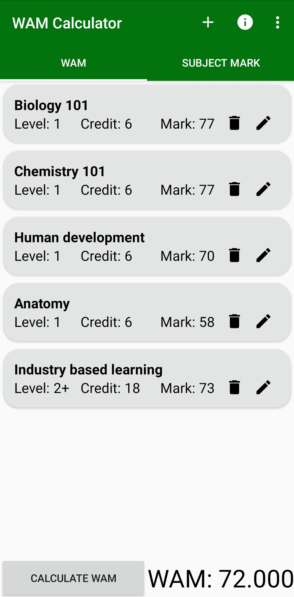

# WAMCalculator

> Calculate your WAM and subject score!

[Check it out here!](https://play.google.com/store/apps/details?id=com.pumpkinsoup.wamcalculator)

## Features

- Calculate a weighted average mark based on the subject scores you input
- Calculate your subject mark based on your assessment scores
- Edit subject details
- Edit assessment details

## Built With

- Java
- XML
- Android Studio IDE

## Try It Out Yourself

1. Clone this repository.
2. Open [Android Studio IDE](https://developer.android.com/studio).
3. In Android Studio, run the app on either an [emulator](https://developer.android.com/studio/run/emulator) or an [Android phone](https://developer.android.com/studio/run/device).

## What I Learned

This is the first app that I created on my own and published on the Google Play Store. So, I learnt the process of publishing an app, which goes from generating a signed Android App Bundle inside Android Studio to using the Google Play Console. I applied many skills I learnt in my Mobile App Development class at uni, such as using a RecyclerView for the subject & assessment cards, using the Room library to locally store data, and using AsyncTask to avoid locking up the UI thread. The Android Developer documentation was very helpful in teaching me how to add new elements to my app, such as the PagerAdapter for the tabs. I really enjoyed creating this app and I'm glad that I created something that I use.   
